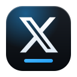
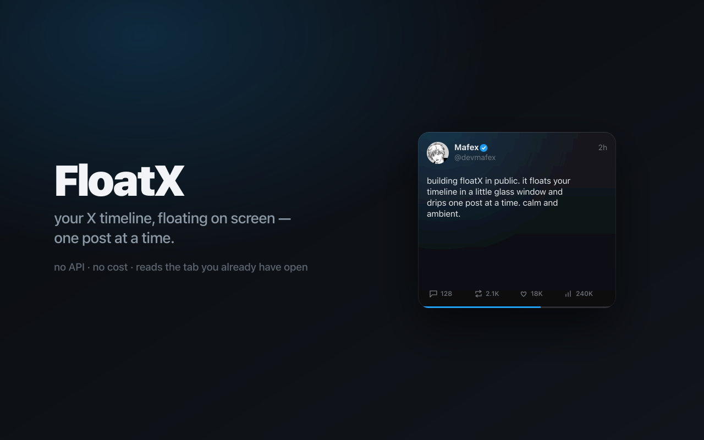
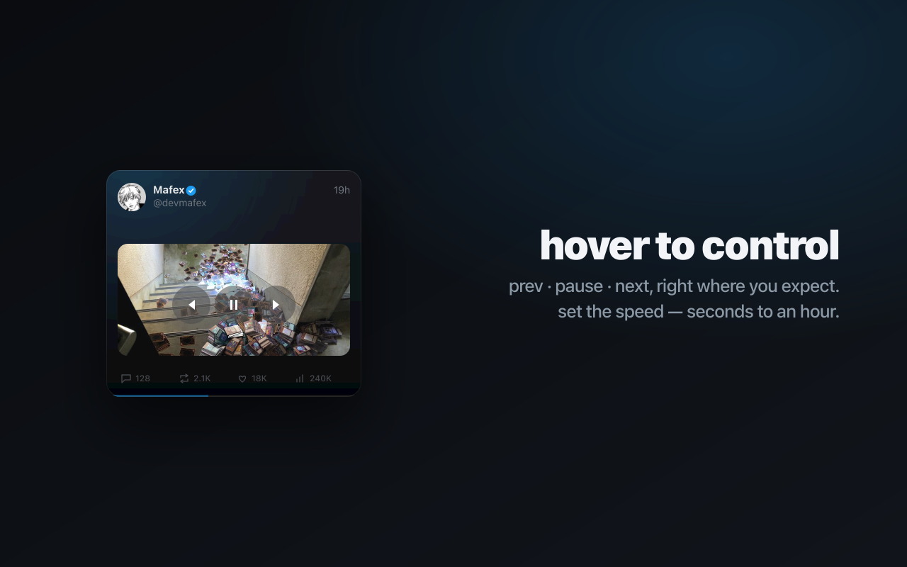
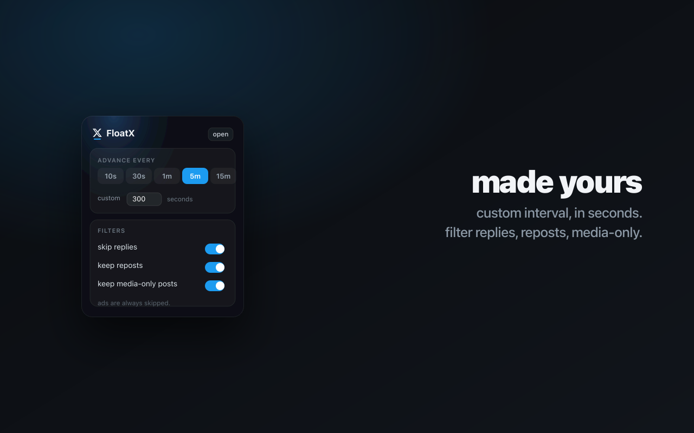
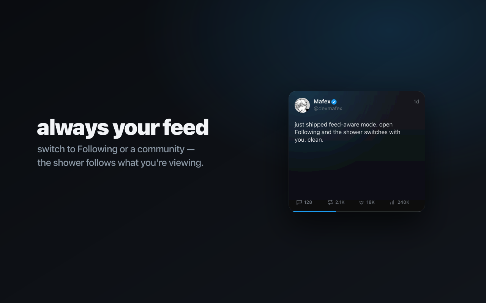

<div align="center">



# FloatX

**an ambient shower of X posts, floating on your screen.**

FloatX drips your X (Twitter) timeline one post at a time into a small,
always-on-top glass window — auto-advancing on a timer, with hover controls,
inline video, and translation. **No API, no cost.** It reads your own
logged-in X session, entirely on your machine.


</div>

---

FloatX comes in two flavors:

| | **Mac app** (recommended) | **Browser extension** |
| --- | --- | --- |
| Runs as | a menu-bar app | inside Chrome / Edge |
| Needs the browser open | no — fully standalone | yes |
| Video playback | ✅ inline | poster only |
| Liquid Glass UI | ✅ | — |
| Resizable / desktop widget | ✅ | — |
| Install | `brew install mafex11/tap/floatx` | load unpacked |

---

## Mac app

A native macOS menu-bar app (macOS 26+). It hosts your own logged-in X session
in a hidden web view, harvests posts, and floats them in a Liquid Glass widget.

### Install

```bash
brew install mafex11/tap/floatx
```

Then look for the **X glyph** in your menu bar. On first launch, sign in to X
in the window that appears (your session stays local) — the window closes itself
once you're in. Click the menu-bar icon to float the widget.

> FloatX is ad-hoc signed (not notarized). If Gatekeeper blocks it, right-click
> the app in `/Applications` → **Open**.

### What it does

- **Auto-advances** one post at a time on an interval you set (seconds to hours).
- **Hover** the left / center / right edges for **prev · pause · next**.
- **Inline video** — X videos autoplay muted, and the shower waits for them to
  finish before advancing.
- **Bottom action bar** — reply and open-in-X open the tweet in your browser;
  **like / repost act in place** in your X session.
- **Translate** — non-English tweets (Japanese, etc.) get a globe button that
  swaps in X's translation.
- **Settings** (right-click the menu-bar icon): interval, transparency, size
  presets (S / M / L / XL), **Desktop mode** (pin to the wallpaper), and
  **Open X feed…** for a full scrollable timeline in-app.

### Features

| | |
| --- | --- |
|  |  |
|  |  |

### Build from source

Requires macOS 26 SDK (Command Line Tools is enough — no full Xcode).

```bash
cd mac
swift build -c release      # build the binary
./build-app.sh 0.1.3        # assemble + ad-hoc sign FloatX.app, zip it
```

---

## Browser extension

A Chrome/Edge extension that floats your timeline in a Document
Picture-in-Picture window. Lighter, but needs the browser open and can't play
video (browsers taint the canvas for cross-origin video).

### Install (unpacked)

1. Download the latest `floatx-*-chrome.zip` from
   [Releases](https://github.com/mafex11/FloatX/releases) and unzip it.
2. Open `chrome://extensions` in Chrome or Edge.
3. Turn on **Developer mode** (top-right).
4. Click **Load unpacked** and pick the unzipped folder.
5. Open `x.com`; the FloatX pill appears on load and on scroll-up. Click it
   (or press **⌥⇧X**) to float the shower.

### How it works

- A **content script** harvests posts from your home timeline (parsing rendered
  `<article>` cards, deduped by tweet id), gently auto-scrolling to refill.
- A **video Picture-in-Picture** surface paints each post onto a canvas and
  streams it, giving a chromeless floating card with native hover controls.
- A **popup** holds settings: interval and filters (skip replies, keep reposts,
  keep media-only — ads are always skipped).

### Develop

```bash
pnpm install      # install deps
pnpm dev          # load the unpacked extension with hot reload (Chrome)
pnpm compile      # type-check
pnpm build        # production build → .output/chrome-mv3
pnpm zip          # packaged zip for distribution
```

The website (landing + install page) lives in `website/`:

```bash
cd website && pnpm install && pnpm dev
```

**Stack:** WXT · React 19 · Tailwind CSS v4 · TypeScript. Website on Astro. Mac
app on SwiftUI + Liquid Glass.

---

## Notes

- **Not affiliated with X Corp.** FloatX reads only your own logged-in session;
  it makes no API calls and sends nothing anywhere.
- X ships UI changes that can break DOM scraping. Selectors live in one place
  (`entrypoints/content/selectors.ts` for the extension, the injected harvester
  for the Mac app) so patching is a one-file job.
- The extension is Chrome/Edge only (Document/Video PiP isn't in Firefox/Safari).
- The Mac app needs macOS 26+ (Liquid Glass).

## License

MIT
